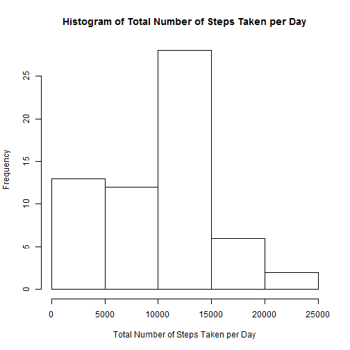
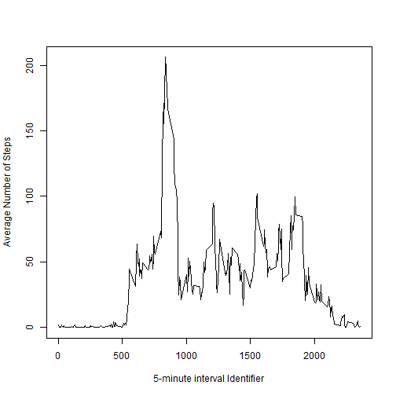
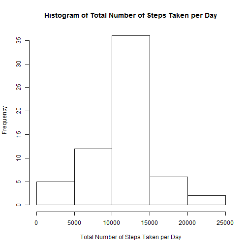

## Loading and preprocessing the data

The data is saved in a zip file called activity.zip. Therefore the data is extracted from the zip file before loading it to R. Then a new feature is created by converting the date feature in to the date class.


```r
Unzip_file<-TRUE #Unzip_file should be set to FALSE if the data is already extracted from the zip file

#Unzip the files
if(Unzip_file){
	unzip("activity.zip")
} 

#Load the data
data<-read.csv("activity.csv")

#Create new feature by converting date feature to date class
data$date2<-strptime(data$date,format="%Y-%m-%d")
```


## What is mean total number of steps taken per day?

For this part of the assignment, the missing values in the dataset were ignored. Then the following steps were taken,

1. Calculate the total number of steps taken per day

2. Make a histogram of the total number of steps taken each day

3. Calculate and report the mean and median of the total number of steps taken per day


```r
#Calculate the total number of steps taken per day while ignoring missing values
totalDailySteps<-tapply(data$steps,data$date,sum,na.rm=TRUE)

#Generate a histogram of the total number of steps taken per day
hist(totalDailySteps,main="Histogram of Total Number of Steps Taken per Day",
     xlab="Total Number of Steps Taken per Day")
```

 

```r
#Calculate the mean of the total number of steps taken per day
meanStep<-mean(totalDailySteps)

#Calculate the median of the total number of steps taken per day
medianStep<-median(totalDailySteps)
```
Mean number of steps taken per day = 9354.2295082  
Median number of steps taken per day = 10395

## What is the average daily activity pattern?

Calculate average number of steps taken, averaged across all days and generate a time series plot


```r
#Calculate average number of steps taken, averaged across all days
AverageSteps<-tapply(data$steps,data$interval,mean,na.rm=TRUE)

#Make a time series plot (i.e. type = "l") of the average number of steps taken vs the 5-minute interval 
plot(data$interval[1:288],AverageSteps,type="l",
       xlab="5-minute interval Identifier",ylab="Average Number of Steps")
```

 

```r
begin<-data$interval[which.max(AverageSteps)]
end<-data$interval[(which.max(AverageSteps))+1]
```
5-minute interval from 835 to 840, contains the maximum number of steps on average across all the days in the dataset. 

## Imputing missing values

The following steps were taken to handle missing values

1. Calculate and report the total number of missing values in the dataset (i.e. the total number of rows with NAs)

2. Create a new dataset that is equal to the original dataset but with the missing data filled in using the **mean of the corresponding 5-minute interval**

3. Make a histogram of the total number of steps taken each day and calculate and report the mean and median total number of steps taken per day. 

```r
#Calculate total number of missing values
sum(is.na(data$steps))
```

```
## [1] 2304
```

```r
#Create a new dataset that is equal to the original dataset but with the missing data filled in using the mean of the corresponding 5-minute interval
data2<-data
for (i in 1:length(data2$steps)){
    if(is.na(data2$steps[i])){
        data2$steps[i]=AverageSteps[as.character(data2$interval[i])]
    }
}

#Calculate the total number of steps taken per day using the new dataset
totalDailySteps2<-tapply(data2$steps,data2$date,sum,na.rm=TRUE)

#Generate a histogram of the total number of steps taken per day using the new dataset
hist(totalDailySteps2,main="Histogram of Total Number of Steps Taken per Day",
     xlab="Total Number of Steps Taken per Day")
```

 

```r
#Calculate the mean of the total number of steps taken per day using the new dataset
meanStep2<-mean(totalDailySteps2)

#Calculate the median of the total number of steps taken per day using the new dataset
medianStep2<-median(totalDailySteps2)
```
Mean number of steps taken per day using the new dataset = 1.0766189 &times; 10<sup>4</sup>  
Median number of steps taken per day using the new dataset = 1.0766189 &times; 10<sup>4</sup>

Do these values differ from the estimates from the first part of the assignment?

Yes

What is the impact of imputing missing data on the estimates of the total daily number of steps?

Since the missing data were filled in using the mean of the corresponding 5-minute interval the central tendency of the data has increased resulting in the mean and the median to be the same value.

## Are there differences in activity patterns between weekdays and weekends?

Using the dataset with the filled-in missing values the following steps were carried out,

1. Create a new factor variable in the dataset with two levels - "weekday" and "weekend" indicating whether a given date is a weekday or weekend day.

2. Make a panel plot containing a time series plot (i.e. type = "l") of the 5-minute interval (x-axis) and the average number of steps taken, averaged across all weekday days or weekend days (y-axis). 


```r
#Create a new factor variable in the dataset with two levels - "weekday" and "weekend" indicating whether a given date is a weekday or weekend day.
data2$day<-ifelse((weekdays(data2$date2) %in% c("Sunday","Saturday")),"weekend","weekday")
data2$day<-as.factor(data2$day)

#Make a panel plot containing a time series plot (i.e. type = "l") of the 5-minute interval (x-axis) and the average number of steps taken, averaged across all weekday days or weekend days (y-axis).
AverageSteps2=aggregate(steps~interval+day,data2,mean)
library(lattice)
xyplot(steps~interval|day,data=AverageSteps2,aspect=1/2,type="l")
```

 
    
